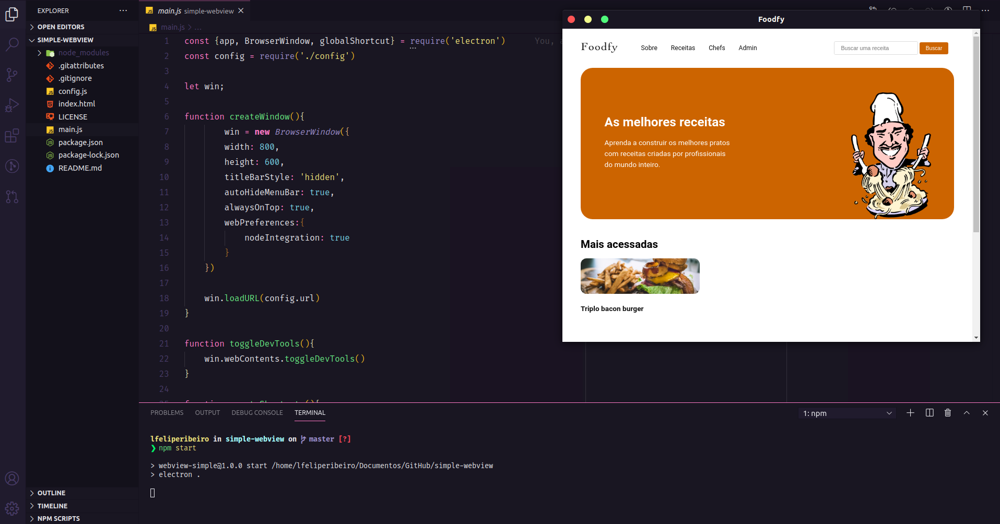

<h3 align="center">    
    <b>Simple Webview</b>      
</h3>

  <a>
  
    

  ## :bookmark: Sobre

<strong>Simple Webview</strong> é uma aplicação desenvolvida em Electron para facilitar a visualização dos navegadores.

## :rocket: Tecnologias Utilizadas

O projeto foi desenvolvido utilizando as seguintes tecnologias:

* Electron
* Node.js
* JavaScript

## :memo: License

Esse projeto está sob a licença MIT. Veja o arquivo [LICENSE](LICENSE.md) para mais detalhes.

---

<h4 align="center">
    Feito com 💜 by <a href="https://www.linkedin.com/in/lfeliperibeiro/" target="_blank">Felipe Ribeiro</a>
</h4>
